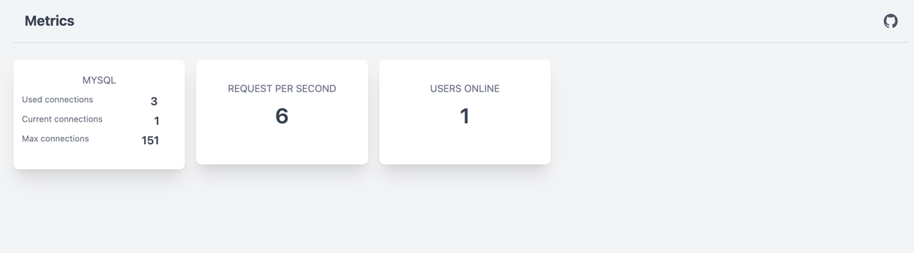

# Laravel Metrics

Laravel Metrics provides an ability to display your custom or default metrics widgets.


[![Stable Version][badge_stable]][link_packagist]
[![Unstable Version][badge_unstable]][link_packagist]
[![Total Downloads][badge_downloads]][link_packagist]
[![License][badge_license]][link_license]

## Table of contents

* [Installation](#installation)
* [Using](#using)
* [Widgets](#widgets)
* [Roadmap](#roadmap)

## Installation

To get the latest version of `Laravel Metrics`, simply require the project using [Composer](https://getcomposer.org):

```bash
$ composer require dedmytro/laravel-metrics
```

Or manually update `require` block of `composer.json` and run `composer update`.

```json
{
    "require": {
        "dedmytro/laravel-metrics": "^0.1"
    }
}
```

And run install command publishes config and assets

```bash
$ php artisan metrics:install
```


## Using

Visit `/metrics` to see dashboard with default widgets. To manage visible widgets open `config/metrics.php` and
check `widgets` key:

```php
    'widgets' => [
        MysqlConnections::class,
        RequestsPerSecond::class,
        UsersOnline::class,
    ],
```

## Widgets

To create your custom widget use default command. By default you can found generated generated widgets in **
app/Metrics/Widgets/**

```bash
$ php artisan metrics:widget ActiveUsersCount --type=value
```

There are few types of widgets (--type=):

#### --type=value

Default type, when no type specified. The simplest widget to display one value.

#### --type=multiple

Widget type which can be used to display multiple values with labels within one widget.

## Roadmap

* More default widgets
* Live widgets
* Chart widget

[badge_downloads]:      https://img.shields.io/packagist/dt/dedmytro/laravel-metrics.svg?style=flat-square

[badge_license]:        https://img.shields.io/packagist/l/dedmytro/laravel-metrics.svg?style=flat-square

[badge_stable]:         https://img.shields.io/github/v/release/dedmytro/laravel-metrics?label=stable&style=flat-square

[badge_unstable]:       https://img.shields.io/badge/unstable-dev--main-orange?style=flat-square

[link_license]:         LICENSE

[link_packagist]:       https://packagist.org/packages/dedmytro/laravel-metrics
